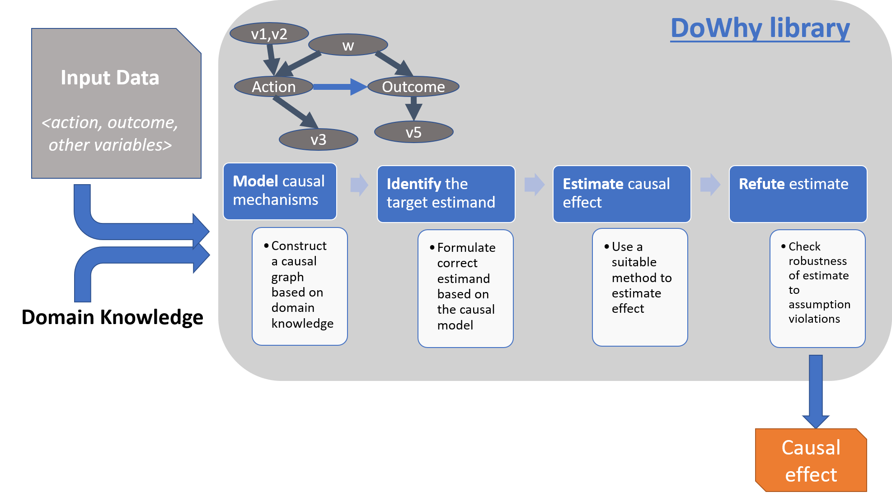

# DoWhy | 인과추론을 위한 라이브러리

원문: [https://microsoft.github.io/dowhy/](https://microsoft.github.io/dowhy/)

DoWhy는 인과추론을 위한 메커니즘을 4단계로 구성했습니다. 1단계 (Model)에서는 데이터를 인과 그래프로 인코딩하고, 2단계 (Identify)에서는 모델의 인과 관계를 식별하고 원인을 추정합니다. 3단계 (Estimate)에서는 식별된 인과관계에 대해 추정치를 구하고 4단계 (Refute)에서는 얻어진 추정치에 대해 반박을 시도합니다.
