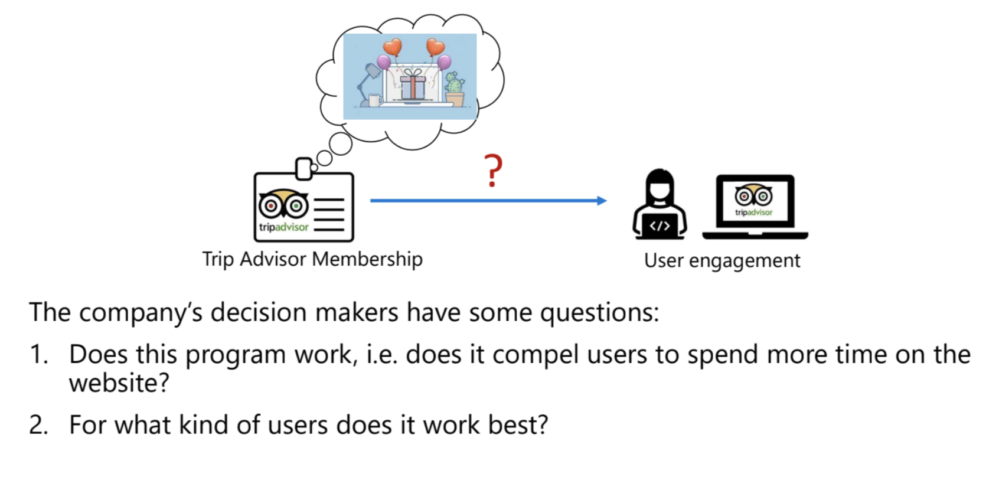

# 멤버십 상품이 유저의 Engagement를 증가시킬까? Recommendation A/B 테스트 - TripAdvisor

* 작성자: 김가연, [최보경](https://www.facebook.com/pagebokyung/)
* 원문: [KDD 2021 Slide](https://drive.google.com/file/d/1yyIu\_3epIVXbwzJj658Iv4vxHGjtPh8n/view) / [ALICE Case Study](https://www.microsoft.com/en-us/research/uploads/prod/2020/04/MSR\_ALICE\_casestudy\_2020.pdf)

TripAdvisor와 Microsoft Research는 협업을 통해 TripAdvisor의 멤버십 제품을 더 잘 이해하고 개선하고자 했습니다. TripAdvisor 서비스는 TripAdvisorPlus라는 멤버십 상품을 출시했습니다. 연간 $99의 가격으로 캐시백, 차량 대여 및 항공권에 있어서의 추가 할인 혜택, 환불에 있어서의 유동성 등의 혜택들이 주어지는데요.

.png>)

TripAdvisor 의사결정권자들은 2가지 질문이 있었습니다.

1. **이 프로그램이 효과적인가?**
   1. 멤버십에 가입하는 것이 유저들이 웹사이트에서 더 많은 체류시간을 보내게 하는가?
   2. 멤버십을 플랫폼에서 홍보하는 것이 유저의 Engagement 와 예약을 증가시키는가?
2. **어떤 종류의 유저에게 가장 효과적인가?**

이 질문에 대답하기 위해서 연구자들은 3가지 방법을 고안했습니다.



**멤버와 멤버가 아닌 집단을 비교하는 방식**

이 경우, 멤버가 되는 집단이 이미 다른 유저에 비해 더 서비스에 대한 Engagement가 높을 수 있으므로 교란 변수가 존재합니다. (Confounders : User affinity)

.png>)



**A/B 테스트**

랜덤하게 일부의 유저들에게 멤버십을 가입하도록 강제할 수 없기에 직접적인 A/B 테스트는 불가능합니다.

.png>)



**Recommendation A/B 테스트를 진행하고 도구변수로 활용하는 방식**

다행히도, TripAdvisor는 유저의 리텐션을 향상시키기 위해 일부 랜덤한 유저에게 멤버십에 더 쉽게 가입하는 프로세스를 추가해 실험을 진행한 적이 있었습니다. 

.png>)



## Methodology

Proposal #3 의 더 쉬운 가입 프로세스(Instrument)는 도구변수의 역할로, 멤버십 가입(Treatment)에는 영향을 주지만 User engagement(Outcome)에는 영향을 주지 않습니다.

일반적으로 도구변수는 활용함에 있어 여러 한계점이 존재합니다. 일반적인 ML 알고리즘처럼 확장하는 것은 어렵고, 약한 도구변수는 효과 추정을 위해 매우 큰 데이터셋이 필요합니다. 또한 complex effect 혹은 compliance heterogeneity 모두에 대해 설명할 수 없어 편향된 결과를 가져올 수 있습니다.

TripAdvisor 의 Recommendation A/B 테스트를 자세히 알아보겠습니다. 400만 유저 중 랜덤으로 절반이 '더 쉬운 가입 프로세스'를 받게 하여 멤버십 가입을 유도합니다.

각 유저마다 아래와 같은 변수를 관측합니다.

- T (treatment) : 유저 멤버십 가입 여부
- Y (outcome) : 실험 이후 14일 동안의 방문 횟수
- X : heterogeneity 를 잡아낼 유저 관련 변수들
- Z (instrumental variables) : Recommendation A/B 테스트 할당

