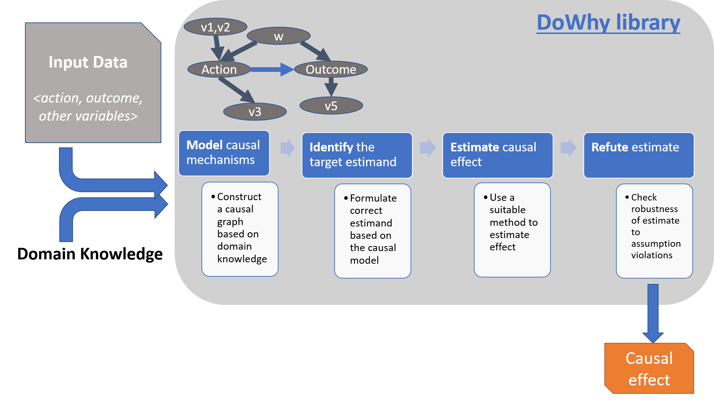

# 추정치를 검증하는 방법

* 작성자: 허현



dowhy는 위 플로우차트 순서대로 진행하도록 정형화 되어있습니다. graph 구축 → identify → estimate → refute 단계이며 각 단계를 간단히 설명하자면

* identify 단계에서는 만들어놓은 그래프의 관계를 규명하는 과정입니다
  * 이미 우리가 알려줬는데 왜 규명해야 할까?
  * DAG 구조인지 확인해야 하고, path에 따라 연결관계를 조정해야 treatment→outcome 효과를 정확히 측정할 수 있기 때문에
* estimate 단계에서는 효과를 추정합니다
* refute 단계에서는 효과가 강건하게 추정된 것인지 검증합니다. 이는 robust check, sensitivity analysis와 같은 절차로 볼 수 있습니다
  * 예측 모델링과 달리 인과 모델링에선 **효과의 방향이 +인지 -인지, 효과의 크기가 얼마나 큰지의 중요도가 높아 중요**한 절차입니다

## dowhy refute 함수

dowhy 라이브러리에서 자동화해놓은 refute는 [add\_unobserved\_common\_cause](https://github.com/microsoft/dowhy/blob/master/dowhy/causal\_refuters/add\_unobserved\_common\_cause.py), [bootstrap\_refuter](https://github.com/microsoft/dowhy/blob/master/dowhy/causal\_refuters/bootstrap\_refuter.py), [data\_subset\_refuter](https://github.com/microsoft/dowhy/blob/master/dowhy/causal\_refuters/data\_subset\_refuter.py), [dummy\_outcome\_refuter](https://github.com/microsoft/dowhy/blob/master/dowhy/causal\_refuters/dummy\_outcome\_refuter.py), [placebo\_treatment\_refuter](https://github.com/microsoft/dowhy/blob/master/dowhy/causal\_refuters/placebo\_treatment\_refuter.py), [random\_common\_cause](https://github.com/microsoft/dowhy/blob/master/dowhy/causal\_refuters/random\_common\_cause.py) 가 있습니다.

이를 유형화 하면 아래 3가지로 나눠 볼 수 있습니다.

1. treatment, outcome 변수를 대체하기
2. 관측 되지 않은 confounder 추가하기
3. 데이터셋으로 작은 집합 만들기

(+) 유형과 무관하게 dowhy refute 방법론은 선정된 횟수(디폴트 100)만큼 refutation을 반복하며 이 반복의 평균값으로 결과값을 보여주고, 추가적으로 test\_significance test 과정을 내부적으로 진행하여 estimate 단계에서 추정한 수치와 통계적으로 유의하게 같은지 검증합니다.

## 1. treatment, outcome 변수를 대체하기

### placebo\_treatment\_refuter

* 기존 DAG 구조에서 treatment에 해당되는 곳을 placebo 데이터로 채워서 refute 진행
* bool 형태면 0/1, int 형태면 정규분포와 같이 기존 treatment 형태에 따라 다르게 랜덤한 값으로 대체
* treatment\_effect가 당연히 0 수준으로 나와야 되고, 위의 test\_significance 통해 원래 구한 값과 다른 것으로 결과가 나와야 통과

### dummy\_outcome\_refuter

* outcome을 가상으로 만들어 refute 진행
* 일반적으로 treatment를 제외한 나머지 변수들로 새로운 y값을 예측하는 모델링을 하고 이 y\_hat을 y 대신 사용하여 estimate\_effect 진행

## 2. 관측 되지 않은 confounder 추가하기

### random\_common\_cause

* 정규분포를 따르는 랜덤한 데이터를 common\_cause(confounder)로 추가하여 refute 진행

### add\_unobserved\_common\_cause

* 관측되지 않은 common cause를 추가하여 estimate\_effect 진행
* 위 random\_common\_cause와의 차이는 가지고 있는 데이터를 통해 만들어진 값으로 common\_cuase(confounder)를 추가한다는 점
* treatment와 outcome의 residual을 활용해 U(unobserved common cause)를 생성
* y\~t+observed 형태로 OLS 진행하고 이 때 구해진 y hat과 y의 차이로 y residual 도출
* t\~observed 형태로 OLS 진행하고 이 때 구해진 t hat과 t의 차이로 t residual 도출

```python
This function simulates an unobserved confounder based on the data using the following steps:
    1. It calculates the "residuals"  from the treatment and outcome model
        i.) The outcome model has outcome as the dependent variable and all the observed variables including treatment as independent variables
        ii.) The treatment model has treatment as the dependent variable and all the observed variables as independent variables.
    2. U is an intermediate random variable drawn from the normal distribution with the weighted average of residuals as mean and a unit variance
       U ~ N(c1*d_y + c2*d_t, 1)
       where
        *d_y and d_t are residuals from the treatment and outcome model
        *c1 and c2 are coefficients to the residuals
    3. The final U, which is the simulated unobserved confounder is obtained by debiasing the intermediate variable U by residualising it with X
```

* 4가지 파라미터 존재 - treatment와 outcome에 대한 unobserved common cause의 관계 형태와 강도에 대한 파라미터
  * confounders\_effect\_on\_treatment
    * "linear", “binary\_flip”
  * confounders\_effect\_on\_outcome
    * "linear", “binary\_flip”
  * effect\_strength\_on\_treatment
  * effect\_strength\_on\_outcome

## 3. 데이터셋으로 작은 집합 만들기

### data\_subset\_refuter

* 디폴트로 선정된 비율(0.8), 횟수(100)만큼 subset을 랜덤 추출하여 estimate\_effect를 진행

### bootstrap\_refuter

* 디폴트로 선정된 횟수(100)만큼 confounder w를 error를 추가하여 estimate\_effect 진행
* confounder에 measurement error(측정 오차)가 있어 잘못된 효과가 추정될 수 있으므로 error term을 추가하는 것

## 추가자료 : Common Misconceptions (흔한 오해)

원문 : [Nick Huntington-Klein 블로그](https://www.nickchk.com/robustness.html)

### **I should "do all the robustness tests."**

No! Why not? The reason has to do with _multiple hypothesis testing_, especially when discussing robustness tests that take the form of statistical significance tests. Roughly, if you have 20 null hypotheses that are _true_, and you run statistical significance tests on all of them at the 95% level, then you will on average reject one of those true nulls just by chance.[4](https://www.nickchk.com/robustness.html#fn4) We commonly think of this problem in terms of looking for results - if you are disappointed with an insignificant result in your analysis and so keep changing your model until you find a significant effect, then that significant effect is likely just an illusion, and not really significant. You just found a significant coefficient by random chance, even though the true effect is likely zero. The same problem applies in the opposite direction with robustness tests. If you just run a whole bunch of robustness tests for no good reason, some of them will fail just by random chance, even if your analysis is totally fine!

And that might leave you in a pickle - do you stick with the original analysis because your failed test was probably just random chance, or do you adjust your analysis because of the failed test, possibly ending up with the wrong analysis?

We can minimize this problem by sticking to testing assumptions you think might actually be dubious in your analysis, or assumptions that, if they fail, would be really bad for the analysis. A good rule of thumb for econometrics in general: don't do anything unless you have a reason for it.

> 모든 테스트를 해야 한다는 것은 잘못된 생각이고 분석 과정에서 의심되는 로버스트 체크를 하는 것이 좋다.\
> 가설 검정에서 랜덤한 데이터로 테스트를 해도 일부는 영가설을 기각해야 된다는 결론이 나오는 것과 같이 검정을 지나치게 많이 하면 우연히 로버스트 체크에서 문제가 될 수 있다.

### **If my analysis passes the robustness tests I do, then it's correct.**

After all, if you are doing a fixed effects analysis, for example, and you did the fixed effects tests you learned about in class, and you passed, then your analysis is good, right?

No! Why not? Because your analysis depends on _all_ the assumptions that go into your analysis, not just the ones you have neat and quick tests for. If you really want to do an analysis super-correctly, you shouldn't be doing one of those fill-in lists above for every _robustness check_ you run - you should be trying to do a fill-in list for every _assumption your analysis makes_. Of course, for some of those assumptions you won't find good reasons to be concerned about them and so won't end up doing a robustness test. But you should think carefully about the A, B, C in the fill-in list for each assumption. This conveniently corresponds to a mnemonic: Ask what each (A)ssumption is, how (B)ad it would be if it were wrong, and whether that assumption is likely to be (C)orrect or not for you.

There's another reason, too - sometimes the test is just weak! Sometimes, even if your assumption is wrong, the test you're using won't be able to pick up the problem and will tell you you're fine, just by chance. Type I error, in other words. There's not much you can do about that. But do keep in mind that passing a test about assumption A is some _evidence_ that A is likely to be true, but it doesn't ever really _confirm_ that A is true. So you can never really be sure. Just try to be as sure as you reasonably can be, and exercise common sense!

> 로버스트 체크를 통과해도 무조건 그 분석이 맞지 않을 수 있다.\
> 테스트 자체는 통과했어도 모델의 가설에 어긋난 분석을 했을 수 있고, 우연의 결과로 통과했을 수도 있다.

### **Robustness tests are always specialized **_**tests**_**.**

No! Why not? Because a robustness test is anything that lets you evaluate the importance of one of your assumptions for your analysis. We've already gone over the robustness test of adding additional controls to your model to see what changes - that's not a specialized robustness test. These kinds of robustness tests can include lots of things, from simply looking at a graph of your data to see if your functional form assumption looks reasonable, to checking if your treatment and control groups appear to have been changing in similar ways in the "before" period of a difference-in-difference (i.e. parallel trends). Don't be fooled by the fancy stuff - getting to know your data and context well is the best way of figuring out what assumptions are likely to be true.

> 이러한 검증법들은 범용적인 아이디어이면서 모델이 가정을 잘 지켰는지 확인하게 도와주는 역할을 한다. difference-in-difference를 검정하기 위해 평행 추세 확인하는 것을 어떤 기법으로 여기지 말고 데이터와 맥락상 적절한 가정이 무엇일지 파악하는 것이 필요하다.
