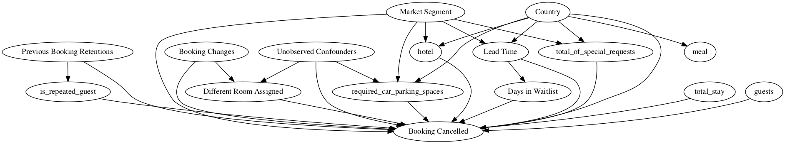
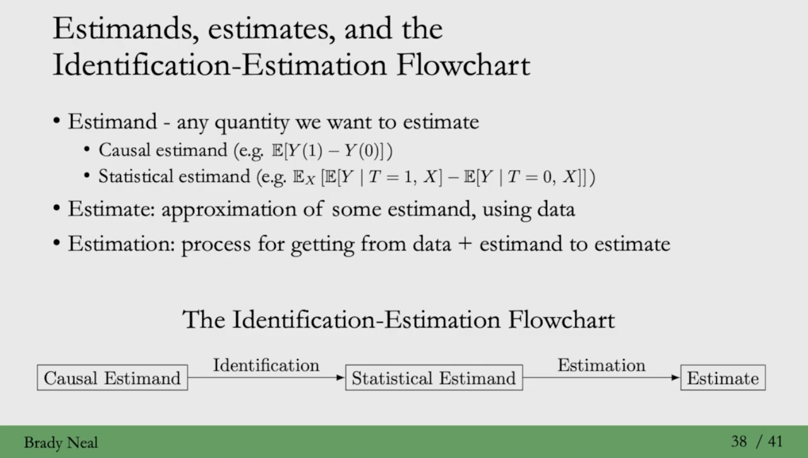

# 호텔 예약 취소에 숨겨진 인과적 이야기

* 작성자: [최보경](https://www.facebook.com/pagebokyung/)
* 원문: [DoWhy - The Causal Story Behind Hotel Booking Cancellations](https://microsoft.github.io/dowhy/example\_notebooks/DoWhy-The%20Causal%20Story%20Behind%20Hotel%20Booking%20Cancellations.html)

## Background


호텔 예약의 취소를 야기하는 요소들이 무엇인지에 대해서 고려합니다. 이 분석은 [Antonio, Almeida and Nunes (2019)](https://www.sciencedirect.com/science/article/pii/S2352340918315191) 의 호텔 예약 데이터셋을 활용했습니다. GitHub 에서는 이 링크에서 확인하실 수 있습니다 : [rfordatascience/tidytuesday](https://github.com/rfordatascience/tidytuesday/blob/master/data/2020/2020-02-11/readme.md).

호텔 예약이 취소되기 까지는 다양한 이유들이 존재합니다.

> A customer may have requested something that was not available (e.g., car parking), a customer may have found later that the hotel did not meet their requirements, or a customer may have simply cancelled their entire trip. Some of these like car parking are actionable by the hotel whereas others like trip cancellation are outside the hotel's control. In any case, we would like to better understand which of these factors cause booking cancellations.

이러한 상황에서, 호텔 예약을 취소하는 원인을 찾기 위해서는 각 고객들이 랜덤하게 두 가지의 카테고리에 속하는 방식의 _Randomized Controlled Trials_ 와 같은 실험이 가장 Golden Standard인데요. 이러한 실험은 특정 상황에서는 너무 비용이 크거나, 윤리적이지 않습니다. 예를 들어 호텔이 고객들에게 서비스의 차등을 준다는 점을 깨닫게 된다면, 호텔의 명성에 손해가 갈 수 있습니다.

관측 데이터를 통해서, 이러한 질문에 대답할 수는 없을까요?

```python
# Config dict to set the logging level : 로깅의 수준을 세팅하기 위한 config 라이브러리

import logging.config
DEFAULT_LOGGING = {
    'version': 1,
    'disable_existing_loggers': False,
    'loggers': {
        '': {
            'level': 'INFO',
        },
    }
}

logging.config.dictConfig(DEFAULT_LOGGING)

# Disabling warnings output
import warnings
from sklearn.exceptions import DataConversionWarning, ConvergenceWarning
warnings.filterwarnings(action='ignore', category=DataConversionWarning)
warnings.filterwarnings(action='ignore', category=ConvergenceWarning)
warnings.filterwarnings(action='ignore', category=UserWarning)
warnings.filterwarnings('ignore')

#!pip install dowhy : dowhy 설치 되지 않았을 경우
import dowhy
import pandas as pd
import numpy as np
import matplotlib.pyplot as plt
```

```python
dataset = pd.read_csv('https://raw.githubusercontent.com/Sid-darthvader/DoWhy-The-Causal-Story-Behind-Hotel-Booking-Cancellations/master/hotel_bookings.csv')
dataset.head()
```

|   | hotel        | is\_canceled | lead\_time | arrival\_date\_year | arrival\_date\_month | arrival\_date\_week\_number | arrival\_date\_day\_of\_month | stays\_in\_weekend\_nights | stays\_in\_week\_nights | adults | ... | deposit\_type | agent | company | days\_in\_waiting\_list | customer\_type | adr  | required\_car\_parking\_spaces | total\_of\_special\_requests | reservation\_status | reservation\_status\_date |
| - | ------------ | ------------ | ---------- | ------------------- | -------------------- | --------------------------- | ----------------------------- | -------------------------- | ----------------------- | ------ | --- | ------------- | ----- | ------- | ----------------------- | -------------- | ---- | ------------------------------ | ---------------------------- | ------------------- | ------------------------- |
| 0 | Resort Hotel | 0            | 342        | 2015                | July                 | 27                          | 1                             | 0                          | 0                       | 2      | ... | No Deposit    | NaN   | NaN     | 0                       | Transient      | 0.0  | 0                              | 0                            | Check-Out           | 2015-07-01                |
| 1 | Resort Hotel | 0            | 737        | 2015                | July                 | 27                          | 1                             | 0                          | 0                       | 2      | ... | No Deposit    | NaN   | NaN     | 0                       | Transient      | 0.0  | 0                              | 0                            | Check-Out           | 2015-07-01                |
| 2 | Resort Hotel | 0            | 7          | 2015                | July                 | 27                          | 1                             | 0                          | 1                       | 1      | ... | No Deposit    | NaN   | NaN     | 0                       | Transient      | 75.0 | 0                              | 0                            | Check-Out           | 2015-07-02                |
| 3 | Resort Hotel | 0            | 13         | 2015                | July                 | 27                          | 1                             | 0                          | 1                       | 1      | ... | No Deposit    | 304.0 | NaN     | 0                       | Transient      | 75.0 | 0                              | 0                            | Check-Out           | 2015-07-02                |
| 4 | Resort Hotel | 0            | 14         | 2015                | July                 | 27                          | 1                             | 0                          | 2                       | 2      | ... | No Deposit    | 240.0 | NaN     | 0                       | Transient      | 98.0 | 0                              | 1                            | Check-Out           | 2015-07-03                |

5 rows × 32 columns

```python
dataset.columns
```

```
Index(['hotel', 'is_canceled', 'lead_time', 'arrival_date_year',
       'arrival_date_month', 'arrival_date_week_number',
       'arrival_date_day_of_month', 'stays_in_weekend_nights',
       'stays_in_week_nights', 'adults', 'children', 'babies', 'meal',
       'country', 'market_segment', 'distribution_channel',
       'is_repeated_guest', 'previous_cancellations',
       'previous_bookings_not_canceled', 'reserved_room_type',
       'assigned_room_type', 'booking_changes', 'deposit_type', 'agent',
       'company', 'days_in_waiting_list', 'customer_type', 'adr',
       'required_car_parking_spaces', 'total_of_special_requests',
       'reservation_status', 'reservation_status_date'],
      dtype='object')
```

## Data Description

변수와 그에 대한 설명을 확인하기 위해서는 [이 링크](https://github.com/rfordatascience/tidytuesday/blob/master/data/2020/2020-02-11/readme.md)를 참조해주세요.

## Feature Engineering

의미 있는 변수들을 만들고, 데이터 셋의 디멘션을 줄이기 위해서 Feature Engineering 을 진행합니다.

* **Total Stay** = stays\_in\_weekend\_nights + stays\_in\_week\_nights
* **Guests** = adults + children + babies
* **Different\_room\_assigned** = 1 if reserved\_room\_type & assigned\_room\_type are different, 0 otherwise.

```python
# Total stay in nights
dataset['total_stay'] = dataset['stays_in_week_nights']+dataset['stays_in_weekend_nights']

# Total number of guests
dataset['guests'] = dataset['adults']+dataset['children'] +dataset['babies']

# Creating the different_room_assigned feature
dataset['different_room_assigned']=0
slice_indices =dataset['reserved_room_type']!=dataset['assigned_room_type']
dataset.loc[slice_indices, 'different_room_assigned'] = 1
```

```python
# Total stay in nights
dataset['total_stay'] = dataset['stays_in_week_nights']+dataset['stays_in_weekend_nights']

# Total number of guests
dataset['guests'] = dataset['adults']+dataset['children'] +dataset['babies']

# Creating the different_room_assigned feature
dataset['different_room_assigned']=0
slice_indices =dataset['reserved_room_type']!=dataset['assigned_room_type']
# Reserved room type 과 Assigned room type 이 다른 인덱스에 대해서, 'different_room_assigned' 컬럼을 1로 채워라
dataset.loc[slice_indices,'different_room_assigned']=1 

# Deleting older features : 가공에 사용되어서 불필요한 피쳐는 삭제합니다.
dataset = dataset.drop(['stays_in_week_nights','stays_in_weekend_nights','adults','children','babies'
                        ,'reserved_room_type','assigned_room_type'],axis=1)

dataset.columns
```

```
Index(['hotel', 'is_canceled', 'lead_time', 'arrival_date_year',
       'arrival_date_month', 'arrival_date_week_number',
       'arrival_date_day_of_month', 'meal', 'country', 'market_segment',
       'distribution_channel', 'is_repeated_guest', 'previous_cancellations',
       'previous_bookings_not_canceled', 'booking_changes', 'deposit_type',
       'agent', 'company', 'days_in_waiting_list', 'customer_type', 'adr',
       'required_car_parking_spaces', 'total_of_special_requests',
       'reservation_status', 'reservation_status_date', 'total_stay', 'guests',
       'different_room_assigned'],
      dtype='object')
```

NULL 값이 있거나, 유저 단위에 1:1 대응이 될 정도로 유니크한 값이 많은 컬럼은 삭제합니다. 또한 `country`의 결측치는 최빈값으로 메웁니다. `distribution_channel` 이라는 컬럼은 `market_segment` 와 겹치는 부분이 많기 때문에 삭제됩니다.

```python
dataset.isnull().sum() # Country,Agent,Company contain 488,16340,112593 missing entries 
```

```
hotel                                  0
is_canceled                            0
lead_time                              0
arrival_date_year                      0
arrival_date_month                     0
arrival_date_week_number               0
arrival_date_day_of_month              0
meal                                   0
country                              488
market_segment                         0
distribution_channel                   0
is_repeated_guest                      0
previous_cancellations                 0
previous_bookings_not_canceled         0
booking_changes                        0
deposit_type                           0
agent                              16340
company                           112593
days_in_waiting_list                   0
customer_type                          0
adr                                    0
required_car_parking_spaces            0
total_of_special_requests              0
reservation_status                     0
reservation_status_date                0
total_stay                             0
guests                                 4
different_room_assigned                0
dtype: int64
```

```python
# 국가 컬럼의 최빈값 확인
dataset['country'].mode()
```

```
0    PRT
dtype: object
```

```python
dataset = dataset.drop(['agent','company'],axis=1)

# Replacing missing countries with most freqently occuring countries
dataset['country']= dataset['country'].fillna(dataset['country'].mode()[0])
```

불필요한 컬럼을 판단해 삭제하고, `different_room_assigned` 와 `is_canceled` 라는 컬럼을 여부에 따라 1,0으로 대체합니다.

```python
dataset = dataset.drop(['reservation_status','reservation_status_date','arrival_date_day_of_month'],axis=1)
dataset = dataset.drop(['arrival_date_year'],axis=1)
dataset = dataset.drop(['distribution_channel'], axis=1)
```

```python
# Replacing 1 by True and 0 by False for the experiment and outcome variables

dataset['different_room_assigned']= dataset['different_room_assigned'].replace(1,True)
dataset['different_room_assigned']= dataset['different_room_assigned'].replace(0,False)
dataset['is_canceled']= dataset['is_canceled'].replace(1,True)
dataset['is_canceled']= dataset['is_canceled'].replace(0,False)
dataset.dropna(inplace=True)
print(dataset.columns)
dataset.iloc[:, 5:20].head(100)
```

```
Index(['hotel', 'is_canceled', 'lead_time', 'arrival_date_month',
       'arrival_date_week_number', 'meal', 'country', 'market_segment',
       'is_repeated_guest', 'previous_cancellations',
       'previous_bookings_not_canceled', 'booking_changes', 'deposit_type',
       'days_in_waiting_list', 'customer_type', 'adr',
       'required_car_parking_spaces', 'total_of_special_requests',
       'total_stay', 'guests', 'different_room_assigned'],
      dtype='object')
```

.dataframe tbody tr th:only-of-type { vertical-align: middle; } .dataframe tbody tr th { vertical-align: top; } .dataframe thead th { text-align: right; }

|     | meal | country | market\_segment | is\_repeated\_guest | previous\_cancellations | previous\_bookings\_not\_canceled | booking\_changes | deposit\_type | days\_in\_waiting\_list | customer\_type | adr    | required\_car\_parking\_spaces | total\_of\_special\_requests | total\_stay | guests |
| --- | ---- | ------- | --------------- | ------------------- | ----------------------- | --------------------------------- | ---------------- | ------------- | ----------------------- | -------------- | ------ | ------------------------------ | ---------------------------- | ----------- | ------ |
| 0   | BB   | PRT     | Direct          | 0                   | 0                       | 0                                 | 3                | No Deposit    | 0                       | Transient      | 0.00   | 0                              | 0                            | 0           | 2.0    |
| 1   | BB   | PRT     | Direct          | 0                   | 0                       | 0                                 | 4                | No Deposit    | 0                       | Transient      | 0.00   | 0                              | 0                            | 0           | 2.0    |
| 2   | BB   | GBR     | Direct          | 0                   | 0                       | 0                                 | 0                | No Deposit    | 0                       | Transient      | 75.00  | 0                              | 0                            | 1           | 1.0    |
| 3   | BB   | GBR     | Corporate       | 0                   | 0                       | 0                                 | 0                | No Deposit    | 0                       | Transient      | 75.00  | 0                              | 0                            | 1           | 1.0    |
| 4   | BB   | GBR     | Online TA       | 0                   | 0                       | 0                                 | 0                | No Deposit    | 0                       | Transient      | 98.00  | 0                              | 1                            | 2           | 2.0    |
| ... | ...  | ...     | ...             | ...                 | ...                     | ...                               | ...              | ...           | ...                     | ...            | ...    | ...                            | ...                          | ...         | ...    |
| 95  | BB   | PRT     | Online TA       | 0                   | 0                       | 0                                 | 0                | No Deposit    | 0                       | Transient      | 73.80  | 0                              | 1                            | 2           | 2.0    |
| 96  | BB   | PRT     | Online TA       | 0                   | 0                       | 0                                 | 0                | No Deposit    | 0                       | Transient      | 117.00 | 0                              | 1                            | 7           | 2.0    |
| 97  | HB   | ESP     | Offline TA/TO   | 0                   | 0                       | 0                                 | 0                | No Deposit    | 0                       | Transient      | 196.54 | 0                              | 1                            | 7           | 3.0    |
| 98  | BB   | PRT     | Online TA       | 0                   | 0                       | 0                                 | 0                | No Deposit    | 0                       | Transient      | 99.30  | 1                              | 2                            | 7           | 3.0    |
| 99  | BB   | DEU     | Direct          | 0                   | 0                       | 0                                 | 0                | No Deposit    | 0                       | Transient      | 90.95  | 0                              | 0                            | 7           | 2.0    |

100 rows × 15 columns

데이터셋에서, No Deposit 으로 예약했으면서 취소한 비율에 대해서 미리 확인해봅니다. 총 104,637건 중에서 29,690건이 취소되었습니다.

```python
dataset = dataset[dataset.deposit_type=="No Deposit"]
dataset.groupby(['deposit_type','is_canceled']).count()
```

|               |              | hotel | lead\_time | arrival\_date\_month | arrival\_date\_week\_number | meal  | country | market\_segment | is\_repeated\_guest | previous\_cancellations | previous\_bookings\_not\_canceled | booking\_changes | days\_in\_waiting\_list | customer\_type | adr   | required\_car\_parking\_spaces | total\_of\_special\_requests | total\_stay | guests | different\_room\_assigned |
| ------------- | ------------ | ----- | ---------- | -------------------- | --------------------------- | ----- | ------- | --------------- | ------------------- | ----------------------- | --------------------------------- | ---------------- | ----------------------- | -------------- | ----- | ------------------------------ | ---------------------------- | ----------- | ------ | ------------------------- |
| deposit\_type | is\_canceled |       |            |                      |                             |       |         |                 |                     |                         |                                   |                  |                         |                |       |                                |                              |             |        |                           |
| No Deposit    | False        | 74947 | 74947      | 74947                | 74947                       | 74947 | 74947   | 74947           | 74947               | 74947                   | 74947                             | 74947            | 74947                   | 74947          | 74947 | 74947                          | 74947                        | 74947       | 74947  | 74947                     |
| True          | 29690        | 29690 | 29690      | 29690                | 29690                       | 29690 | 29690   | 29690           | 29690               | 29690                   | 29690                             | 29690            | 29690                   | 29690          | 29690 | 29690                          | 29690                        | 29690       | 29690  |                           |

판다스에는 데이터프레임의 복사본을 만들어주는 pandas.DataFrame.copy가 있고 a = b와는 다른 방식의 복사입니다.

* a = b는 원본 데이터가 변하면 똑같이 변하는 얕은 복사인 반면, pandas.DataFrame.copy는 복사 당시의 데이터프레임 상태만 복사되는 깊은 복사입니다.
* 얕은 복사를 하면 복사본은 원본과 데이터/index를 공유하지만, 깊은 복사는 복사본이 자신만의 데이터/index를 갖게합니다.

```python
dataset_copy = dataset.copy(deep=True) 
```

## Calculating Expected Counts : Confounder 를 유추할 수 있는 간단한 방법

예약 취소의 개수와, 다른 방에 배정되는 케이스의 개수가 심각하게 불균형적이기 때문에, 랜덤으로 최초 1000개의 관측치를 선택하며 `is_cancelled` & `different_room_assigned` 가 같은 값을 달성하는지를 확인합니다. 이 전체적인 프로세스는 10000회 반복되고, 그 중에서 예상되는 달성 횟수는 50%에 가깝습니다. 그 이유는 두개의 변수가 같은 값을 랜덤하게 가질 수 있을 확률은 50% 이기 때문입니다.

따라서 통계적으로 이야기하면, 이 단계에서 유한한 결론이 있는 것은 아닙니다. 따라서, 고객이 예약한 방과 다른 방을 배정하는 상황은 그 고객이 예약을 취소하게 할수도, 아닐수도 있습니다.

**첫번째 시나리오**는, 아무 조건 가정 없이 샘플링을 진행합니다.

```python
counts_sum=0
for i in range(1,10000):
        counts_i = 0
        # 데이터셋에서 1000개의 행을 랜덤 샘플링합니다.
        rdf = dataset.sample(1000)
        # is_canceled FALSE, different_room_assigned FALSE
        # is_canceled TRUE, different_room_assigned TRUE 인 행들의 개수를 셉니다.
        counts_i = rdf[rdf["is_canceled"]== rdf["different_room_assigned"]].shape[0]
        # 이 과정을 10000회 반복하면서, 총 몇개의 행들이 같았는지를 더합니다.
        counts_sum+= counts_i

# 10000회 반복 시행을 종료했을 때, 평균적으로 몇개의 행들이 같았는지를 파악합니다.
counts_sum/10000
```

`588.7015`

**두번째 시나리오**는, 예약에 변경이 없었을 것이라는 조건을 가정한 후에 샘플링을 진행합니다.

```python
# Expected Count when there are no booking changes : booking_changes = 0 이라는 조건을 걸어 계층화할 경우

counts_sum=0
for i in range(1,10000):
        counts_i = 0
        # 조건을 건 후 그 중에서 1000개의 행을 랜덤 샘플링합니다.
        rdf = dataset[dataset["booking_changes"]==0].sample(1000)
        counts_i = rdf[rdf["is_canceled"]== rdf["different_room_assigned"]].shape[0]
        counts_sum+= counts_i
        
counts_sum/10000
```

`572.608`

**세번째 시나리오**는 예약에 변경이 있었을 것이라는 조건(>0)을 가정한 후에 샘플링을 진행합니다.

```python
# Expected Count when there are booking changes = 66.4%
counts_sum=0
for i in range(1,10000):
        counts_i = 0
        # 조건을 건 후 그 중에서 1000개의 행을 랜덤 샘플링합니다.
        rdf = dataset[dataset["booking_changes"]>0].sample(1000)
        counts_i = rdf[rdf["is_canceled"]== rdf["different_room_assigned"]].shape[0]
        counts_sum+= counts_i
        
counts_sum/10000
```

`666.015`

확실히 예약에 변경이 있었을 것이라는 조건을 통해서, 무언가 숫자에 변화를 볼 수 있습니다. `booking_changes` 변수가 곧 교란변수가 될 수 있다는 힌트가 됩니다.

하지만 `booking_changes` 변수가 유일한 교란변수일까요? 만일 관측되지 않은 교란변수가 있고, 그것이 데이터셋에 변수 형태로 포함되지 않은 정보라면, 우리는 이 `booking_changes` 변수가 곧 교란변수가 될 수 있다는 주장을 계속할 수 있을까요?

***

## _DoWhy_ 의 시작

## Step-1. Create a Causal Graph : 인과 그래프 생성하기

예측 모델링 문제에 대한 사전지식을, 인과 그래프 형태로 가정을 사용해서 표현합니다. 전체 그래프를 이 단계에서 표현하지 않아도, 일부 그래프만 표현하여도 충분합니다. 나머지는 DoWhy 를 통해서 찾을 수 있습니다.

아래 내용이 인과 모형으로 해석된 몇 개의 가정들입니다.

* `Market Segment` 변수 : TA(Travel Agents), TO(Tour Operators) 라는 2가지 값으로 구성되며, `Lead Time` 변수에 영향을 줍니다.
* `Country` 변수 : 한 사람이 일찍 호텔을 예약할지, 아닐지에 대해 좌우하는 역할을 할 수 있으며, 궁극적으로 일찍 호텔을 예약하는 행동은 `Lead Time` 변수에 영향을 줍니다. 그 외로도, `Meal` 변수에도 영향을 줍니다.
* `Lead Time` 변수 : `Days in Waitlist` 변수에 확실하게 영향을 줍니다. 늦게 예약할수록, 예약을 할 수 있는 기회가 적어지기 때문입니다. 추가적으로 높은 `Lead Time` 은 `Cancellations` 변수를 높아지게 만들 수 있습니다.
* `Previous Booking Retentions` 변수 : 고객의 `Repeated Guest` 여부를 좌우하고, 이 두개의 변수는 모두 `Cancelled` 에도 영향을 줄 수 있습니다. 리텐션이 높았던 고객일수록 취소할 확률이 낮고, 리텐션이 낮았던 즉 늘 취소했던 고객이라면 취소할 확률이 높습닌다.
* `Booking Changes` 변수 : 예약을 변경하는 것은 `Different room assigned` 변수를 좌우하고, `Cancellation` 에도 영향을 줄 수 있습니다.

정리하면, `Booking Changes` 변수가 Treatment, Outcome 에 영향을 주는 가장 유일한 교란변수일 확률은 낮습니다. 현재 변수는 물론, 데이터셋에 고려되지 않은 정보들까지 포함하여 다른 관측되지 않은 교란변수가 많을 것입니다.

### Pygraphviz 활용

pygraphviz 설치에서 에러가 발생할 경우, 터미널에서 아래와 같이 해결할 수 있습니다.

`brew install graphviz` `pip install graphviz` `pip install pygraphviz`

Diagraph 란, Edge 와 Node 로 구성되고 추가적인 데이터나 특성을 포함합니다. Self loops 는 가능하지만, Multiple edge 는 허용되지 않습니다. 노드는 주로 임의의 해싱가능한 Python 객체입니다. Edge는 노드간의 링크입니다. ([설명](https://networkx.org/documentation/stable/reference/classes/digraph.html#))

```python
import pygraphviz

# 변수명[label = 그림에 표기될 이름]
# 변수명(label 없으면 변수명 그대로 그림에 표기됨)
# U = Unobserved confounder
# 변수명 -> 변수명 : 영향을 주는 관계
# 변수명 -> {변수명, 변수명} : 다수에 영향을 주는 변수 관계

causal_graph = """digraph {
    different_room_assigned[label="Different Room Assigned"];
    is_canceled[label="Booking Cancelled"];
    booking_changes[label="Booking Changes"];
    previous_bookings_not_canceled[label="Previous Booking Retentions"];
    days_in_waiting_list[label="Days in Waitlist"];
    lead_time[label="Lead Time"];
    market_segment[label="Market Segment"];
    country[label="Country"];
    U[label="Unobserved Confounders"];
    
    is_repeated_guest;
    total_stay;
    guests;
    meal;
    hotel;
    
    U->different_room_assigned; 
    U->is_canceled;
    U->required_car_parking_spaces;
    
    market_segment -> lead_time;
    lead_time -> is_canceled; 
    country -> lead_time;
    different_room_assigned -> is_canceled;
    country -> meal;
    lead_time -> days_in_waiting_list;
    days_in_waiting_list -> is_canceled;
    previous_bookings_not_canceled -> is_canceled;
    previous_bookings_not_canceled -> is_repeated_guest;
    is_repeated_guest -> is_canceled;
    total_stay -> is_canceled;
    guests -> is_canceled;
    booking_changes -> different_room_assigned; 
    booking_changes -> is_canceled; 
    hotel -> is_canceled;
    required_car_parking_spaces -> is_canceled;
    total_of_special_requests -> is_canceled;
    
    country -> {hotel, required_car_parking_spaces,total_of_special_requests,is_canceled};
    market_segment -> {hotel, required_car_parking_spaces,total_of_special_requests,is_canceled};
    }"""
```

여기서, Treatment 는 고객이 예약한 방을 그대로 배정해주는 것입니다. Outcome은 예약이 취소되었는지에 대한 여부입니다.

* Common Causes : 우리의 인과 그래프에 따라 Treatment, Outcome 에 영향을 줄 수 있는 변수들을 의미합니다.
* 앞서 세운 인과적 가정에 따르면 이 Common Causes 가 될 수 있는 조건을 만족하는 변수는 `Booking Changes` 그리고 `Unobserved Confounders` 변수 2가지 입니다.

따라서, 만일 그래프를 명시적으로 작성하지 않을 경우에는 아래 함수에 따라 파라미터들을 제공할 수 있습니다.

> So if we are not specifying the graph explicitly (Not Recommended!), one can also provide these as parameters in the function mentioned below.

```python
model= dowhy.CausalModel(
        data = dataset,
        graph = causal_graph.replace("\n", " "), # causal_graph 라는 문자열에서 띄어쓰기를 space 로 대체해주는 역할
        treatment = 'different_room_assigned',
        outcome = 'is_canceled') 
model.view_model()

from IPython.display import Image, display
display(Image(filename = "causal_model.png"))
```

```
INFO:dowhy.causal_model:Model to find the causal effect of treatment ['different_room_assigned'] on outcome ['is_canceled']
```



## Step-2. Identify Causal Effect : 인과 효과 식별하기

우리는 모든 다른 것들을 유지한 채로 Treatment 를 변화시킬 때, Outcome 에 변화가 있다면 Treatment가 Outcome의 원인이 된다라고 이야기합니다. 따라서 이 단계에서는, 인과 그래프의 특성들을 활용해서 추정하고자 하는 인과 효과를 식별합니다.

dowhy.CausalModel() 클래스를 활용해서 모델을 입력하게 되면, 아래 함수들을 사용할 수 있습니다. ([모듈 코드](https://microsoft.github.io/dowhy/\_modules/dowhy/causal\_model.html))

* identify\_effect()
  * Identified estimand 를 리턴하는 주요한 메소드. 만일 Estimand 의 타입이 non-parametric ATE라면, 주어진 인과 모형에서 Identified estimand가 있는지를 확인하기 위해서 Backdoor / Instrumental Variable / Frontdoor Identification 메소드들을 사용합니다.
* estimate\_effect()
  * Step-3 에서 이어집니다.
* do()
* refute\_estimate()
* view\_model()
* interpret()
* summary()

### Estimand

예를 들어, 7년간의 월별 수익이 Gaussian 분포를 따른다고 가정합니다. Gaussian 분포는 평균, 분산을 Parameter 로 가지고 있어, 이 경우에 개별 월 수입은 Random variable 이라고 할 수 있습니다. ([출처](https://fullfu.tistory.com/2))



* Estimand : (예시) Gaussian의 Parameter 가 되는 평균, 분산
* Estimate : Random variable 로 월별 수익을 추정한 값
  * 평균의 Estimate : 100만원 +- standard error
  * 표준 편차의 Estimate : 10만원
* Estimator : Random variable 로부터 Estimate를 얻어내는 함수
  * 평균의 Estimator : mu = sigma(월 수입) / 총 월 수
  * 표준 편차의 Estimate : s = sqrt(sigma(월 수입 - 평균 월 수입) / (총 월 수 -1))

> 인과효과 연구에서 관심 모집단의 특성과 연관지어 분석 결과를 해석하고 추론하는 것은 중요하며, 이에 연구자는 통계적 추론(inference)를 위한 관심 모수(estimand; parameter of interest)를 정의하고 이에 대한 추정치(estimates)를 산출하게 된다.

```python
import statsmodels

# Identify the causal effect : 아까 위에서 명시한 model 을 활용합니다.
identified_estimand = model.identify_effect(proceed_when_unidentifiable = True)
print(identified_estimand)
```

```
Estimand type: nonparametric-ate

### Estimand : 1
Estimand name: backdoor
Estimand expression:
            d
──────────────────────────(Expectation(is_canceled|country,booking_changes,mar
d[different_room_assigned]


ket_segment,required_car_parking_spaces,total_of_special_requests,guests,days_


in_waiting_list,lead_time,total_stay,meal,is_repeated_guest,previous_bookings_


not_canceled,hotel))

Estimand assumption 1, Unconfoundedness: If U→{different_room_assigned} and U→is_canceled then P(is_canceled|different_room_assigned,country,booking_changes,market_segment,required_car_parking_spaces,total_of_special_requests,guests,days_in_waiting_list,lead_time,total_stay,meal,is_repeated_guest,previous_bookings_not_canceled,hotel,U) = P(is_canceled|different_room_assigned,country,booking_changes,market_segment,required_car_parking_spaces,total_of_special_requests,guests,days_in_waiting_list,lead_time,total_stay,meal,is_repeated_guest,previous_bookings_not_canceled,hotel)

### Estimand : 2
Estimand name: iv
No such variable found!

### Estimand : 3
Estimand name: frontdoor
No such variable found!
```

## Step-3. Estimate Identified Estimand :

dowhy.CausalModel() 클래스를 활용해서 모델을 입력하게 되면, 아래 함수들을 사용할 수 있습니다. [모듈 코드](https://microsoft.github.io/dowhy/\_modules/dowhy/causal\_model.html)

* identify\_effect()
* estimate\_effect()
  * method\_name 파라미터 값으로 아래 종류들이 있습니다.
    * Propensity Score Matching: “backdoor.propensity\_score\_matching”
    * Propensity Score Stratification: “backdoor.propensity\_score\_stratification”
    * Propensity Score-based Inverse Weighting: “backdoor.propensity\_score\_weighting”
    * Linear Regression: “backdoor.linear\_regression”
    * Generalized Linear Models (e.g., logistic regression): “backdoor.generalized\_linear\_model”
    * Instrumental Variables: “iv.instrumental\_variable”
    * Regression Discontinuity: “iv.regression\_discontinuity”
* do()
* refute\_estimate()
* view\_model()
* interpret()
* summary()

```python
estimate = model.estimate_effect(identified_estimand, 
                                 method_name="backdoor.propensity_score_stratification",target_units="ate")

# target_units can be these three : 
# ATE = Average Treatment Effect
# ATT = Average Treatment Effect on Treated (i.e. those who were assigned a different room)
# ATC = Average Treatment Effect on Control (i.e. those who were not assigned a different room)

print(estimate)
```

```
*** Causal Estimate ***

## Identified estimand
Estimand type: nonparametric-ate

## Realized estimand
b: is_canceled~different_room_assigned+previous_bookings_not_canceled+hotel+total_of_special_requests+market_segment+is_repeated_guest+guests+lead_time+meal+days_in_waiting_list+country+booking_changes+total_stay+required_car_parking_spaces
Target units: ate

## Estimate
Mean value: -0.2508732026233869
```

**결과는 꽤나 놀라웠습니다. 다른 방에 배정받는게 취소할 확률을 낮춰준다는 결과를 의미하기 때문입니다. (-0.251만큼) 여기서, 이게 정말 맞는 인과 효과일까요?**

다른 메커니즘이 작용했을 수 있습니다. 다른 방에 배정받는 시간적인 상황이 체크인 때만 발생한다면? 이미 호텔에 와있기 때문에 취소할 수 있는 확률이 당연히 낮습니다. 이러한 케이스라면, 이 예약 취소가 언제 발생했는지에 대한 시각 정보가 주요한 변수가 됩니다. 예를 들어, `different_room_assigned` 변수가 예약을 한 당일에 주로 발생한다면 또 어떨까요? 이런 변수를 알게 됨으로써 그래프와 분석을 향상시킬 수 있습니다.

앞서 진행했던 연관성 분석이, `is_canceled` 와 `different_room_assigned` 사이의 양의 상관관계를 보였는데요. DoWhy를 통해서 인과 효과를 예측하는 것은 그 반대로, 아예 다른 그림을 보였습니다. 이는 곧, 다른 방에 배정하는 현상의 수를 줄이는 정책은 곧 호텔에게 비생산적인 방향의 정책일 수 있다는 점을 암시합니다.

## Step-4. Refute results

주의해야 할 점은 인과효과는 데이터셋으로부터 발견되는 것이 아니라, Identification 으로 이끄는 연구자의 가정(Assumptions)을 통해서 발견 됩니다. 데이터는 단순히 통계적인 추정(Estimation)에만 사용됩니다. 즉, 가정이 맞았는지 아닌지에 대해서 증명하는 것이 정말 중요합니다.

* 다른 Common cause 가 존재한다면?
* Treatment 자체가 Placebo 효과라면?

### Method-1

**Add Random Common Cause:**

* 랜덤한 독립 변수를 Common cause로 데이터셋에 추가했을 때, 현재의 추정 메소드가 다른 추정치를 돌려줄까요?
* 데이터에서 랜덤하게 공변량 변수들을 Draw하고, 동일한 분석을 재 진행하여 인과 추정치가 변화하는지를 봅니다. (CNN 돌릴 때 랜덤 값 조정하여 강건성 확인하듯이)
* 정규 분포 내에 랜덤하게 빼고 더하는 형태로 변수 추가
* 가정이 본래 옳았다면, 인과 추정치는 크게 변화해서는 안됩니다.

```python
refute1_results = model.refute_estimate(identified_estimand, estimate,
        method_name = "random_common_cause")

print(refute1_results)
```

```
    Refute: Add a Random Common Cause
    Estimated effect:-0.2509269875427757
    New effect:-0.2484279296616035
```

### Method-2

**Placebo Treatment Refuter:**

* 실제 Treatment 변수 `different_room_assigned` 를 랜덤한 독립 변수로 대체한다면, 추정된 인과 효과는 어떻게 변화할까요?
* 데이터에서 랜덤하게 공변량 변수를 하나 Draw하고 Treatment로 대체하여 동일한 분석을 재 진행하여 인과 추정치가 변화하는지를 봅니다.
* 가정이 본래 옳았다면, 새로운 추정치는 0에 가까워야 합니다.
* p-value 는 New effect 가 통계적으로 유의하게 0과 다른지를 검정합니다.
* p-value < 0.05 라면 New effect가 0과 다르기 때문에 인과 추정치가 문제가 있다는 것을 의미합니다.

```python
refute2_results=model.refute_estimate(identified_estimand, estimate,
        method_name="placebo_treatment_refuter")

print(refute2_results)
```

```
Refute: Use a Placebo Treatment
Estimated effect:-0.2509269875427757
New effect:7.121213729569751e-05
p value:0.5
```

### Method-3

**Data Subset Refuter:**

* 주어진 전체 데이터 셋을, 랜덤하게 선택한 데이터셋 일부로 대체한다면 인과 추정치가 변화할까요?
* Cross-validation과 유사한 방식으로 데이터셋의 subset 을 생성합니다. 인과 추정치가 subset들에 걸쳐서 차이가 나는지를 확인합니다.
  * Making use of Bootstrap as we have more than 100 examples.The greater the number of examples, the more accurate are the confidence estimates
  * 정해진 subset을 추출하는 trial 수가 있고, 각 subset 마다의 결과는 보여지지 않고 결과량은 하나.이 값은 어떻게 추출되었는지?
* 가정이 본래 옳았다면, 분산이 크지 않습니다.
* p-value 는 New effect 가 통계적으로 유의하게 Estimated effect 와 다른지를 검정합니다.
* p-value < 0.05 라면 두 Effect가 다르기 때문에 인과 추정치가 문제가 있다는 것을 의미합니다. ([출처](https://issueexplorer.com/issue/microsoft/dowhy/312))

```python
refute3_results=model.refute_estimate(identified_estimand, estimate,
        method_name="data_subset_refuter")
print(refute3_results)
```

```
Refute: Use a subset of data
Estimated effect:-0.2509269875427757
New effect:-0.2495950577205681
p value:0.28
```

우리의 추정치가 세 가지의 Refutation test를 통과하는 것을 확인했습니다. 이는 추정치의 정확함을 증명하는 것은 아니지만, 추정치의 신뢰도를 높여줍니다.
