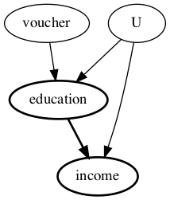

# 도구변수를 활용하여 인과효과를 추정하기


- 작성자: [최보경](https://www.facebook.com/pagebokyung/) 
- 원문: [Simple example on using Instrumental Variables method for estimation](https://microsoft.github.io/dowhy/example_notebooks/dowhy-simple-iv-example.html)


```python
# !pip install dowhy
```


```python
%load_ext autoreload
%autoreload 2
```


```python
import numpy as np
import pandas as pd
import patsy as ps

from statsmodels.sandbox.regression.gmm import IV2SLS
import os, sys
from dowhy import CausalModel
```

## Loading the dataset 
개인의 교육이 미래 소득에 주는 영향을 추정하기 위한, 가상의 데이터 셋을 생성합니다.
- 교란변수(unobserved confounder) : 개인의 능력(ability)
- 도구변수(instrumental variable) : 교육 보조(education_voucher)


```python
n_points = 10000 # 데이터 개수
education_abilty = 1 # discrete
education_voucher = 2 # discrete
income_abilty = 2 # discrete
income_education = 4 # education 과 곱해지는 계수로, 찾고자 하는 인과효과 estimate 의 정답지


# confounder (unobserved)
ability = np.random.normal(0, 3, size=n_points)

# instrument
voucher = np.random.normal(2, 1, size=n_points)

# treatment
education = np.random.normal(5, 1, size=n_points) + education_abilty * ability +\
            education_voucher * voucher

# outcome
income = np.random.normal(10, 3, size=n_points) +\
         income_abilty * ability + income_education * education
```


```python
# 가상의 dataset (exclude confounder `ability` which we assume to be unobserved)
data = np.stack([education, income, voucher]).T
df = pd.DataFrame(data, columns = ['education', 'income', 'voucher'])
df.head()
```


<div>
<style scoped>
    .dataframe tbody tr th:only-of-type {
        vertical-align: middle;
    }

    .dataframe tbody tr th {
        vertical-align: top;
    }

    .dataframe thead th {
        text-align: right;
    }
</style>
<table border="1" class="dataframe">
  <thead>
    <tr style="text-align: right;">
      <th></th>
      <th>education</th>
      <th>income</th>
      <th>voucher</th>
    </tr>
  </thead>
  <tbody>
    <tr>
      <th>0</th>
      <td>5.638493</td>
      <td>29.349797</td>
      <td>1.974566</td>
    </tr>
    <tr>
      <th>1</th>
      <td>8.522389</td>
      <td>46.239001</td>
      <td>1.949956</td>
    </tr>
    <tr>
      <th>2</th>
      <td>12.840748</td>
      <td>64.198096</td>
      <td>2.253389</td>
    </tr>
    <tr>
      <th>3</th>
      <td>2.954071</td>
      <td>15.591053</td>
      <td>0.939508</td>
    </tr>
    <tr>
      <th>4</th>
      <td>10.117519</td>
      <td>51.873490</td>
      <td>1.779209</td>
    </tr>
  </tbody>
</table>
</div>

## Using DoWhy to estimate the causal effect of education on future income
**4가지 절차를 따릅니다.**
1. 문제를 인과 그래프로 모델링합니다. (model)
2. 관측된 변수로부터 인과추론이 될 수 있는지 확인합니다. (identify)
3. 인과효과를 추정합니다. (estimate)
4. 인과효과 추정치의 Robustness 를 확인합니다. (refute)

## step 1 : model
```python
model = CausalModel(
          data = df,
          treatment = 'education',
          outcome = 'income',
          common_causes = ['U'], # unobserved confounding 을 임의의 U 컬럼에 넣는 것
          instruments = ['voucher']
        )
model.view_model()

from IPython.display import Image, display
display(Image(filename="causal_model.png"))
```




## step 2 : identify
```python
identified_estimand = model.identify_effect(proceed_when_unidentifiable = True)
print(identified_estimand)
```
    Estimand type: nonparametric-ate
    
    ### Estimand : 1
    Estimand name: backdoor1 (Default)
    Estimand expression:
         d                           
    ────────────(Expectation(income))
    d[education]                     
    Estimand assumption 1, Unconfoundedness: If U→{education} and U→income then P(income|education,,U) = P(income|education,)
    
    ### Estimand : 2
    Estimand name: iv
    Estimand expression:
    Expectation(Derivative(income, [voucher])*Derivative([education], [voucher])**
    (-1))
    Estimand assumption 1, As-if-random: If U→→income then ¬(U →→{voucher})
    Estimand assumption 2, Exclusion: If we remove {voucher}→{education}, then ¬({voucher}→income)
    
    ### Estimand : 3
    Estimand name: frontdoor
    No such variable found!


**identify_effect()**

Identified Estimand 를 리턴해주는 메소드로, Estimand 가 3가지 타입이 나옵니다. 

Estimand 의 종류가 non-parametric ATE 일 때 `Backdoor / IV / Frontdoor` 와 같은 Identification methods 를 리턴합니다.


```python
# step 3 : estimate
# step 2 에서 Estimand 가 3가지가 있는데, 그중에서 IV 를 선택함. 

estimate = model.estimate_effect(identified_estimand, 
                                 method_name = 'iv.instrumental_variable',
                                 test_significance = True)

print(estimate)
```
```
Estimand type: nonparametric-ate

### Estimand : 1
Estimand name: backdoor
Estimand expression:
     d
────────────(Expectation(income))
d[education]
Estimand assumption 1, Unconfoundedness: If U→{education} and U→income then P(income|education,,U) = P(income|education,)

### Estimand : 2
Estimand name: iv
Estimand expression:
Expectation(Derivative(income, [voucher])*Derivative([education], [voucher])**
(-1))
Estimand assumption 1, As-if-random: If U→→income then ¬(U →→{voucher})
Estimand assumption 2, Exclusion: If we remove {voucher}→{education}, then ¬({voucher}→income)

### Estimand : 3
Estimand name: frontdoor
No such variable found!
```

## Step 3: Estimate
```
#Choose the second estimand: using IV
estimate = model.estimate_effect(identified_estimand,
        method_name="iv.instrumental_variable", test_significance=True)

print(estimate)
```
```
*** Causal Estimate ***

## Identified estimand
Estimand type: nonparametric-ate

### Estimand : 1
Estimand name: iv
Estimand expression:
Expectation(Derivative(income, [voucher])*Derivative([education], [voucher])**
(-1))
Estimand assumption 1, As-if-random: If U→→income then ¬(U →→{voucher})
Estimand assumption 2, Exclusion: If we remove {voucher}→{education}, then ¬({voucher}→income)

## Realized estimand
Realized estimand: Wald Estimator
Realized estimand type: nonparametric-ate
Estimand expression:

Expectation(Derivative(income, voucher))⋅Expectation(Derivative(education, vou

      -1
cher))
Estimand assumption 1, As-if-random: If U→→income then ¬(U →→{voucher})
Estimand assumption 2, Exclusion: If we remove {voucher}→{education}, then ¬({voucher}→income)
Estimand assumption 3, treatment_effect_homogeneity: Each unit's treatment ['education'] is affected in the same way by common causes of ['education'] and income
Estimand assumption 4, outcome_effect_homogeneity: Each unit's outcome income is affected in the same way by common causes of ['education'] and income

Target units: ate

## Estimate
Mean value: 3.984270555650861
p-value: [0, 0.001]
```

**해석 방법**
교육(education)을 한 단위 높일 때, 소득(income)이 4.01 포인트 가량 높아진다는 의미를 가지는 Estimate (추정치)를 보입니다.

추정된 인과효과는, p-value 가 0 ~ 0.001 사이로 통계적으로 유의합니다. 

그 다음으로는, Placebo refutation test 를 통해서 이 추정치의 강건성을 검사합니다. 이 테스트에서는, 독립확률변수(X)가 도구변수와의 상관관계를 유지하면서, Treatment를 대체하도록 합니다. 따라서 진실된 인과효과는 0이 됩니다. 

이 Estimator 가 올바르게 0에 가까운 값을 리턴하는지를 확인합니다.

## step 4 : refute
```
ref = model.refute_estimate(identified_estimand, 
                            estimate,
                            method_name = "placebo_treatment_refuter", 
                            placebo_type = "permute")

print(ref)
```
```
Refute: Use a Placebo Treatment
Estimated effect:3.984270555650861
New effect:-0.004644847508369445
p value:0.43999999999999995
```


## 2SLS와 비교

2-stage linear square regression 동일한 로직이기 때문에 기존 패키지의 coefficient, p-value 와 동일한 결과를 보입니다.

```
income_vec, endog = ps.dmatrices("income ~ education", data=df)
exog = ps.dmatrix("voucher", data=df)
```
```
m = IV2SLS(income_vec, endog, exog).fit()
m.summary()
```


<table class="simpletable">
<caption>IV2SLS Regression Results</caption>
<tr>
  <th>Dep. Variable:</th>         <td>income</td>      <th>  R-squared:         </th> <td>   0.890</td> 
</tr>
<tr>
  <th>Model:</th>                 <td>IV2SLS</td>      <th>  Adj. R-squared:    </th> <td>   0.890</td> 
</tr>
<tr>
  <th>Method:</th>               <td>Two Stage</td>    <th>  F-statistic:       </th> <td>1.373e+04</td>
</tr>
<tr>
  <th></th>                    <td>Least Squares</td>  <th>  Prob (F-statistic):</th>  <td>  0.00</td>  
</tr>
<tr>
  <th>Date:</th>             <td>Sun, 19 Dec 2021</td> <th>                     </th>     <td> </td>    
</tr>
<tr>
  <th>Time:</th>                 <td>09:48:50</td>     <th>                     </th>     <td> </td>    
</tr>
<tr>
  <th>No. Observations:</th>      <td> 10000</td>      <th>                     </th>     <td> </td>    
</tr>
<tr>
  <th>Df Residuals:</th>          <td>  9998</td>      <th>                     </th>     <td> </td>    
</tr>
<tr>
  <th>Df Model:</th>              <td>     1</td>      <th>                     </th>     <td> </td>    
</tr>
</table>
<table class="simpletable">
<tr>
      <td></td>         <th>coef</th>     <th>std err</th>      <th>t</th>      <th>P>|t|</th>  <th>[0.025</th>    <th>0.975]</th>  
</tr>
<tr>
  <th>Intercept</th> <td>   10.2193</td> <td>    0.314</td> <td>   32.568</td> <td> 0.000</td> <td>    9.604</td> <td>   10.834</td>
</tr>
<tr>
  <th>education</th> <td>    3.9779</td> <td>    0.034</td> <td>  117.195</td> <td> 0.000</td> <td>    3.911</td> <td>    4.044</td>
</tr>
</table>
<table class="simpletable">
<tr>
  <th>Omnibus:</th>       <td> 3.175</td> <th>  Durbin-Watson:     </th> <td>   1.953</td>
</tr>
<tr>
  <th>Prob(Omnibus):</th> <td> 0.204</td> <th>  Jarque-Bera (JB):  </th> <td>   3.137</td>
</tr>
<tr>
  <th>Skew:</th>          <td> 0.040</td> <th>  Prob(JB):          </th> <td>   0.208</td>
</tr>
<tr>
  <th>Kurtosis:</th>      <td> 3.032</td> <th>  Cond. No.          </th> <td>    25.7</td>
</tr>
</table>


